# Gimnasio ForceTech - Sistema de Gestión

## 👥 Integrantes y Roles SCRUM

El desarrollo del proyecto se llevó a cabo utilizando la metodología ágil **SCRUM**, asignando los siguientes roles entre todos los miembros del equipo:

* **Simón** – *Product Owner* (Encargado de priorizar el backlog y validar los requisitos del negocio)

* **Angie** – *Scrum Master* (Facilitadora del proceso ágil, eliminación de impedimentos y gestión del tablero)
* **Frank** – *Development Team* (Desarrollador e implementador de módulos en Python)
* **Juan Diego** – *Development Team* (Desarrollador e implementador de módulos en Python)

> **Nota:** Todos los integrantes contribuyeron activamente en el desarrollo y la escritura del código del proyecto.

---

## 📌 Resumen del Proyecto

**Gimnasio ForceTech** es una aplicación de consola en Python diseñada para gestionar integralmente las operaciones de un gimnasio. Permite el control de clientes, instructores, servicios (yoga, pilates, entrenamiento personalizado, piscina y gimnasio general) con control estricto de capacidad máxima, asignación de matrículas, registro de asistencias y evaluaciones físicas de progreso, así como la generación de reportes analíticos para la toma de decisiones.

El sistema soporta tres roles principales con menús interactivos:
1. **Administrador:** Acceso completo a la gestión de clientes, servicios, instructores, matrículas, asistencias, evaluaciones y reportes.
2. **Instructor:** Acceso al registro de asistencias, evaluaciones de progreso físico y consulta de clientes.
3. **Cliente:** Acceso exclusivo para consultar su perfil, historial de asistencias y evolución en sus evaluaciones físicas.

---

## ⚙️ Descripción Detallada de los Módulos

### 1. Módulo Principal (`main.py`)
* **Propósito:** Punto de entrada del sistema y orquestador del menú principal por roles.
* **Funcionamiento:** Carga los datos almacenados e inicializa los servicios base al arrancar. Muestra interfaces de consola segmentadas para Administrador, Instructor y Cliente. Ante cualquier cambio realizado en la información, invoca la persistencia para guardar los datos automáticamente.

### 2. Módulo de Persistencia (`modulos/persistencia.py`)
* **Propósito:** Manejar el almacenamiento de datos de forma permanente mediante un archivo JSON.
* **Funcionamiento:** Lee y escribe la información en `datos.json`. En caso de no existir o presentar errores de formato, inicializa las estructuras vacías necesarias para los clientes, servicios, instructores y matrículas.

### 3. Módulo de Validaciones (`modulos/validaciones.py`)
* **Propósito:** Garantizar la integridad y consistencia de los datos ingresados por el usuario.
* **Funcionamiento:** Proporciona funciones de control para validar que los nombres no contengan números, que las cadenas no estén vacías, que los números de teléfono tengan 7 o 10 dígitos, que los valores numéricos estén dentro de rangos permitidos y que las fechas cumplan con el formato `DD/MM/AAAA`.

### 4. Módulo de Clientes (`modulos/clientes.py`)
* **Propósito:** Administrar los expedientes de los clientes, sus estados, niveles de riesgo, asistencias y valoraciones físicas.
* **Funcionamiento:** Permite registrar clientes evitando identificaciones duplicadas, cambiar su estado (En proceso de inscripción, Inscrito, Activo, Inactivo) y nivel de riesgo (Alto, Medio, Bajo). Almacena listas internas para registrar fechas de asistencia y evaluaciones físicas periódicas.

### 5. Módulo de Servicios (`modulos/servicios.py`)
* **Propósito:** Administrar las disciplinas y actividades ofrecidas por el gimnasio.
* **Funcionamiento:** Define una lista base de servicios con sus respectivas capacidades máximas de aforo y permite la creación de nuevos servicios asignando identificadores incrementales automáticos.

### 6. Módulo de Instructores (`modulos/instructores.py`)
* **Propósito:** Controlar el personal de entrenadores e instructores disponibles.
* **Funcionamiento:** Permite registrar entrenadores con su documento, nombre completo y estado (Activo o Inactivo), además de filtrar las listas para mostrar únicamente aquellos disponibles para ser asignados a matrículas.

### 7. Módulo de Matrículas (`modulos/matriculas.py`)
* **Propósito:** Gestionar la inscripción de clientes a servicios específicos vinculando un instructor activo.
* **Funcionamiento:** Calcula los cupos disponibles de un servicio restando las matrículas activas a la capacidad máxima. Valida que el cliente no esté inactivo, que el instructor esté activo y que el cliente no posea ya una matrícula activa en el mismo servicio antes de formalizar el registro o permitir cancelaciones.

### 8. Módulo de Reportes (`modulos/reportes.py`)
* **Propósito:** Generar consolidados analíticos para el monitoreo administrativo del gimnasio.
* **Funcionamiento:** Filtra listas de clientes inscritos, calcula el aforo disponible por servicio, lista instructores activos y evalúa métricas promedio para identificar clientes con bajo rendimiento físico (promedio menor a 5.0) o de riesgo alto.

---

## 📋 Historias de Usuario e Implementación

### 🔹 Historia de Usuario 1
* **Requerimiento (RF01) - Prioridad Alta:** 

  Registro e inscripción de nuevos clientes.
* **Actor:** Administrador.
* **Descripción:** Como Administrador quiero registrar nuevos clientes capturando sus datos personales, contacto, estado y nivel de riesgo para formalizar su ingreso al gimnasio.
* **Implementación:** Se implementó la función `registrar_cliente()` en `modulos/clientes.py`. Solicita número de identificación, nombres, apellidos, dirección, teléfonos, estado y nivel de riesgo.
* **Criterios de Aceptación:**
  1. El sistema no permite clientes con identificaciones duplicadas.
  2. La dirección no puede quedar vacía.
  3. Los teléfonos deben contener entre 7 y 10 dígitos.
  4. El estado y el nivel de riesgo se seleccionan desde listas predefinidas.

---

### 🔹 Historia de Usuario 2
* **Requerimiento (RF03) - Prioridad Alta:** 

  Asignación de Matrículas con Control de Capacidad.
* **Actor:** Administrador.
* **Descripción:** Como Administrador quiero matricular un cliente en un servicio específico asignando un instructor activo para llevar el control de suscripciones.
* **Implementación:** Se implementó la función `registrar_matricula()` en `modulos/matriculas.py`. Valida el estado del cliente, verifica cupos disponibles en el servicio solicitado y asigna un instructor activo.
* **Criterios de Aceptación & Restricciones:**
  1. No se puede matricular a un cliente en estado "Inactivo".
  2. Si los cupos ocupados alcanzan la capacidad máxima del servicio, el sistema deniega la matrícula.
  3. Solo se pueden asignar instructores con estado "Activo".
  4. *Restricción:* Un cliente no puede tener dos matrículas activas en el mismo servicio simultáneamente.

---

### 🔹 Historia de Usuario 3
* **Requerimiento (RF04) - Prioridad Media:** 

  Evaluación Física y Control de Progreso.
* **Actor:** Instructor / Administrador.
* **Descripción:** Como Instructor quiero registrar valoraciones físicas periódicas a los clientes para hacer seguimiento a sus cambios de fuerza, resistencia, flexibilidad y peso.
* **Implementación:** Se implementó la función `registrar_progreso()` en `modulos/clientes.py`. Guarda una evaluación física que incluye el peso en kg y métricas del 1 al 10 para fuerza, resistencia y flexibilidad.
* **Criterios de Aceptación:**
  1. Las puntuaciones de resistencia, fuerza y flexibilidad deben estar en el rango de 1 a 10.
  2. La fecha debe registrarse con formato válido `DD/MM/AAAA`.
  3. La evaluación queda enlazada a la identificación del cliente.

---

### 🔹 Historia de Usuario 4
* **Requerimiento (RF05) - Prioridad Media:** 

  Reporte de Clientes con Bajo Rendimiento.
* **Actor:** Administrador.
* **Descripción:** Como Administrador quiero visualizar un listado de clientes cuyo rendimiento promedio sea bajo para ofrecerles acompañamiento especializado.
* **Implementación:** Se implementó la función `reporte_bajo_rendimiento()` en `modulos/reportes.py`. Calcula el promedio de las métricas de la última evaluación física y muestra a los clientes con promedio strictly inferior a 5.0.
* **Criterios de Aceptación & Restricciones:**
  1. Promedia las métricas de resistencia, fuerza y flexibilidad de la última evaluación registrada.
  2. Filtra y muestra únicamente a los clientes con promedio menor a 5.0.
  3. *Restricción:* Los clientes sin evaluaciones físicas registradas son omitidos de este reporte.

---

### 🔹 Historia de Usuario 5
* **Requerimiento (RF06) - Prioridad Media:** 

  Consulta de Perfil y Progreso por el Cliente.
* **Actor:** Cliente.
* **Descripción:** Como Cliente del gimnasio quiero consultar mi información personal, mis asistencias y mi historial de progreso para ver mi evolución.
* **Implementación:** Se implementaron las funciones `consultar_perfil()`, `consultar_progreso()` y `consultar_asistencia()` en `modulos/clientes.py`, integradas en el menú `menu_cliente()` dentro de `main.py`.
* **Criterios de Aceptación & Restricciones:**
  1. El cliente consulta introduciendo su número de identificación.
  2. Muestra de forma clara el historial ordenado de sus evaluaciones físicas y fechas de asistencia.
  3. *Restricción:* El cliente no puede modificar ni alterar los registros desde su menú.

---
## 📋 Tablero SCRUM
 
Durante el desarrollo del proyecto se utilizó Notion para la planificación, seguimiento y control de las actividades del Sprint.

 
🔗 **Acceder al tablero SCRUM:**
 https://app.notion.com/p/Proyecto-ForceTech-SCRUM-3e99022ea78880f48d3af8ba97e68d98

## 📸 Documentación y Evidencias de la Metodología SCRUM

A continuación se presentan las capturas tomadas del documento Word con la documentación oficial y evidencias del cumplimiento de las ceremonias SCRUM (Sprint Planning, Daily Stand-up, Sprint Review y Sprint Retrospective), así como el panel de gestión Kanban y la asignación de roles:

🔗 **Acceder al Documento SCRUM:**
https://drive.google.com/file/d/1GX9Oz-N3z_2K8d-W3P7YjOweO_mrTscJ/view?usp=sharing

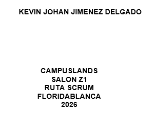

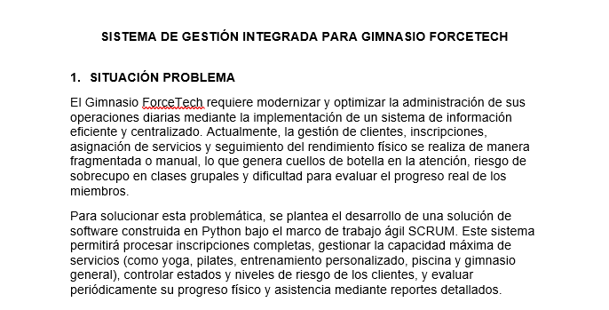

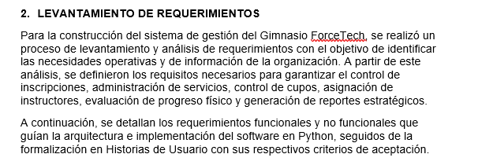

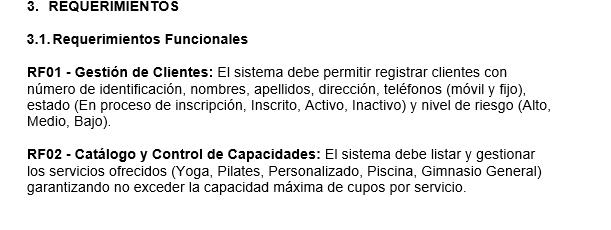

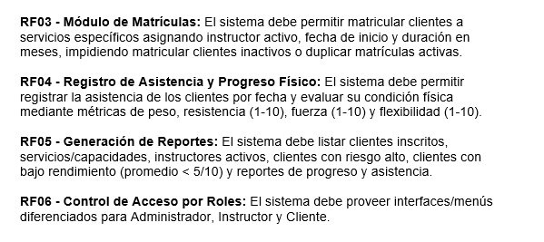

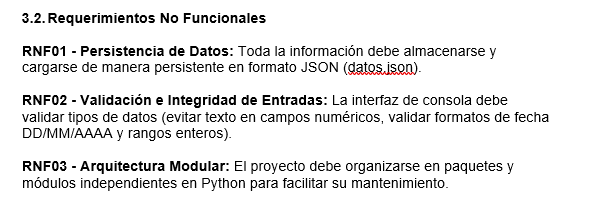

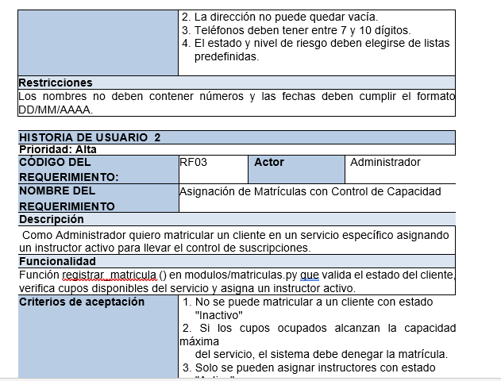

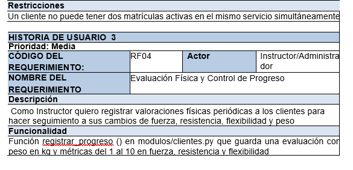

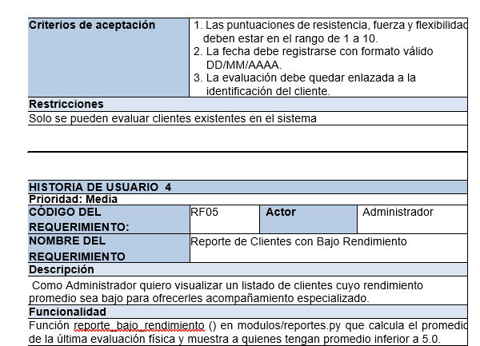

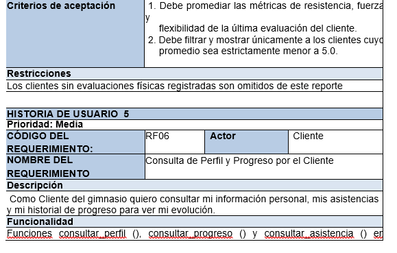

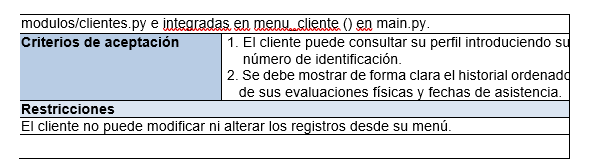

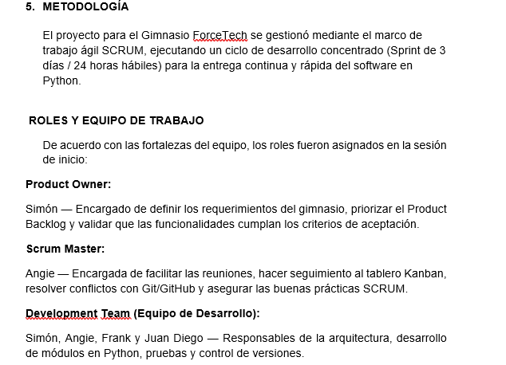

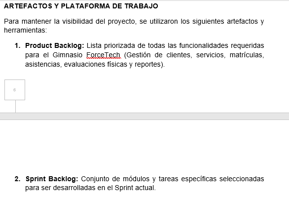

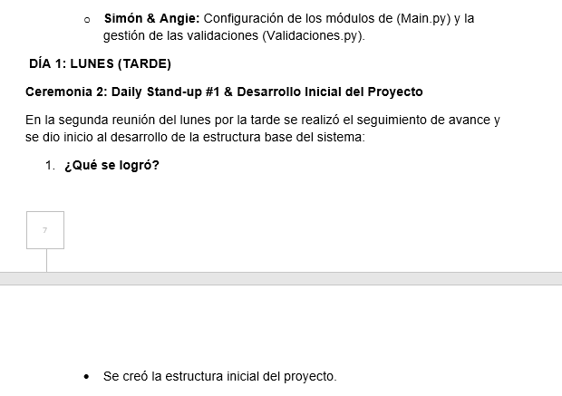

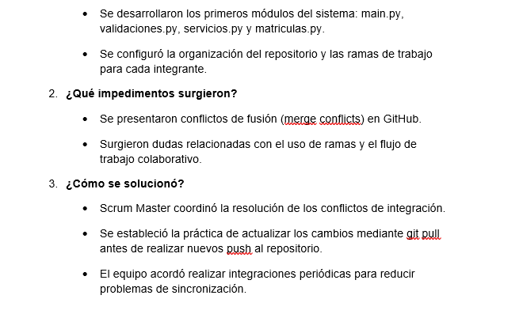

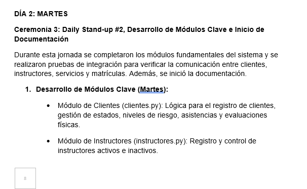

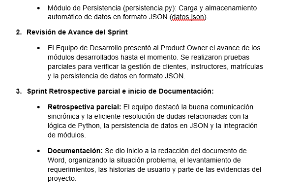

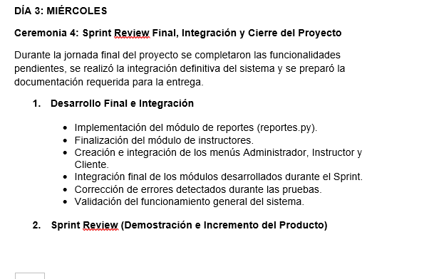

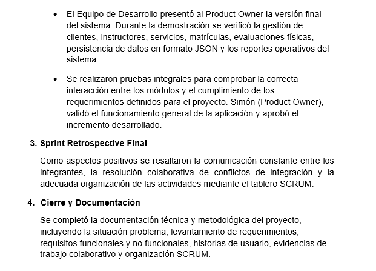

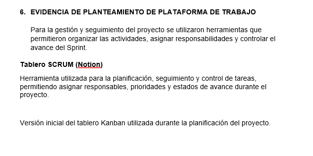

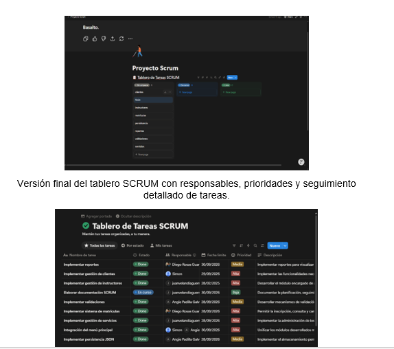

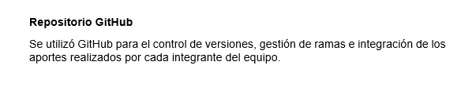

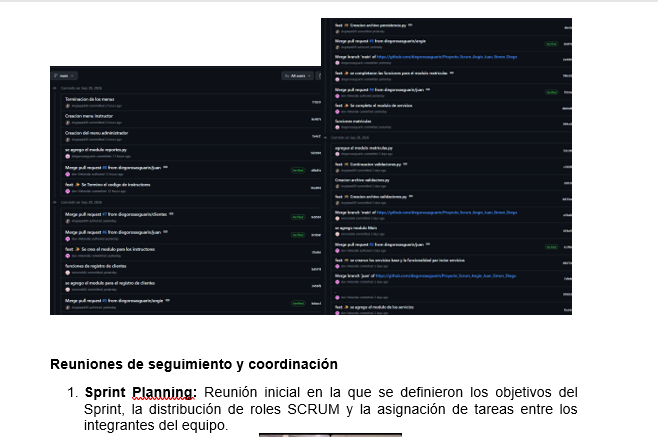

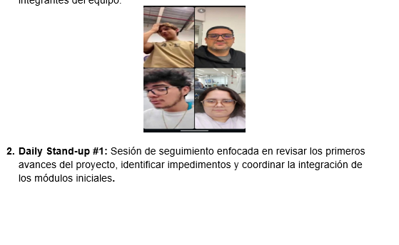

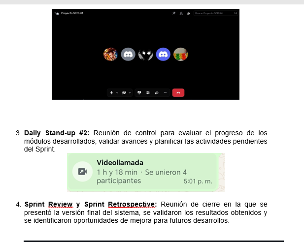

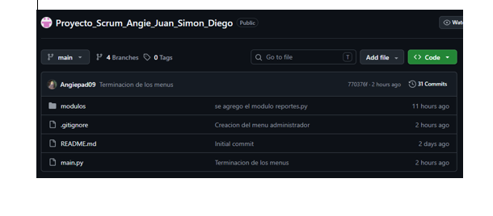

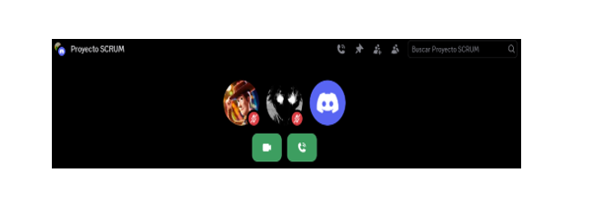

